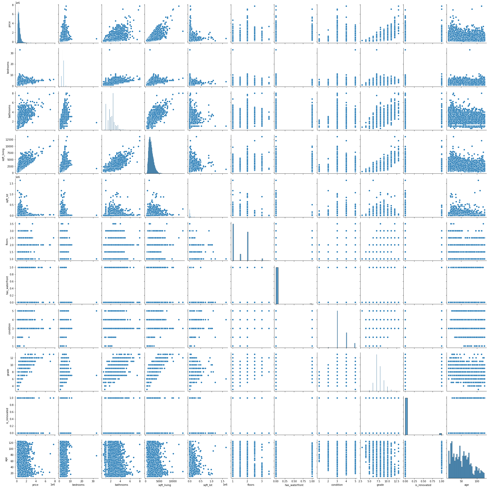
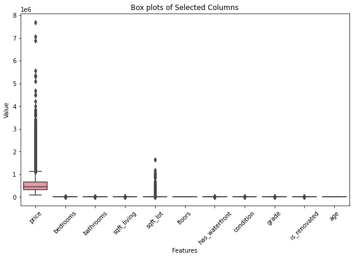

# Project 2 (Group Work)

# King County House Price Prediction using Linear Regression Model

## Project Overview

## Data Source
This project utilizes the King County House Sales dataset, which is available in `kc_house_data.csv` located in the `data` folder of this repository.

## Business Understanding

## Introduction
The real estate market is a dynamic and complex field influenced by numerous factors that affect property values. Predicting house prices accurately is crucial for buyers, sellers, real estate agents, and investors to make informed decisions. This project aims to develop a linear regression model to predict house prices using a variety of independent variables, including physical attributes of the properties, location-based features, and other relevant factors. By leveraging data analysis and machine learning techniques, this project seeks to provide a robust tool for estimating property values, thereby enhancing decision-making processes in the real estate sector.

## Problem Statement
Homeowners and real estate agents often face the challenge of accurately predicting home values and identifying which renovations will yield the highest return on investment. Inaccurate valuations can affect home sales and lead to significant losses for both buyers and sellers. Uninformed renovation decisions can result in unnecessary expenditures without a corresponding increase in property value. For a real estate agency that helps homeowners buy and sell homes, providing accurate home valuations and precise advice on effective renovations is crucial. Traditional methods often fail to capture the complexity and interactions between different factors, leading to less reliable predictions. This project addresses the problem of developing a reliable and accurate predictive model for house prices using linear regression, incorporating a comprehensive set of independent variables to improve prediction accuracy.

## Objectives
1. Develop a model that accurately predicts the value of a house based on its features.

   Investigate the most important features in homes to create an accurate model for 
   estimating home value.
   
3. Explore and quantify the relationship between renovations and property value and refine 
   the model based on the results.

   Determine whether renovations affect home prices. If a relationship exists, quantify it and 
   refine the model to improve accuracy.
 
4. Offer tailored recommendations to homeowners based on their property characteristics and market conditions.

   Provide homeowners with accurate property valuations and advise on whether renovations would 
   be a worthwhile investment if they intend to sell.

## Data Understanding
Read the data stored in kc_house_data.csv using pandas
Then accesses columns in our dataset using df.columns
#### Column Names and Descriptions for Kings County Data Set
id - unique identifier for the house

date - date the house was sold

price - is prediction target

bedrooms - number of bedrooms

bathrooms - number of bathrooms

sqft_livingsquare - square footage of the home

sqft_lotsquare - square footage of the lot

floors - number of floors in the house

waterfront - does the house have waterfront view?

view - has the house been viewed?

condition - How good is the overall condition is of the house?

grade - overall grade given to the housing unit, based on King County grading system

sqft_above - square footage of house apart from basement

sqft_basement - square footage of the basement

yr_built - year house was built

yr_renovated - year when house was renovated

zipcode - area zip code

lat - latitude coordinate

long - longitude coordinate

sqft_living15 - The square footage of interior housing living space for the nearest 15 neighbors

sqft_lot15 - The square footage of the land lots of the nearest 15 neighbors

## EDA & DATA CLEANING
Here we drop irrelevant columns.
### Columns dropped:
- date
- view
- sqft_above
- sqft_basement
- yr_renovated
- zipcode
- lat
- long
- sqft_living15
- sqft_lot15
Then check for null values using df.isna().sum().Fill nans with zeros, the assumption being that they have no water fronts and/or they have not been renovated, This because the percentage of nans for yr_renovated is almost  a significant 20% and may affect our analysis if we drop
next we convert waterfront and yr_renovated to boolean values, and give them suitable names

## Feature Selection

#### Visualizing the dataset using a pairplot to explore correlations and distributions
use sns.pairplot

Visualizing the correlation using a heatmap

#### Checking the correlation between the independent variables to the price(our target variable)
Checked how diifferent independent variables relate to price
- The correlation between price and bedrooms has a coefficient of 0.309453, indicating a moderate positive relationship. As the number of bedrooms increases, the price of the house tends to increase, but the relationship is not very strong.
- The correlation between price and bathrooms has a coefficient of 0.526229, indicating a moderate to strong positive relationship. More bathrooms are associated with higher house prices.
- The correlation between price and Sqft_living has a coefficient of 0.701875, indicating a strong positive relationship. Houses with larger living areas (square footage) tend to be more expensive.
- The correlation between price and sqft_lot has a coefficient of 0.089111, indicating a very weak positive relationship. The size of the lot has little impact on the house price.
- The correlation between price and floors has a coefficient of 0.256286, indicating a weak to moderate positive relationship. More floors are somewhat associated with higher house prices.
- The correlation between price and waterfront has a coefficient of 0.264898, indicating a weak to moderate positive relationship. Houses located on the waterfront tend to be more expensive.
- The correlation between price and condition has a coefficient of 0.034779, indicating an almost negligible positive relationship. The condition of the house has little to no impact on the price.
- The correlation between price and grade has a coefficient of 0.668020, indicating a strong positive relationship. Higher-grade houses (quality of construction and design) tend to be more expensive.
- The correlation between price and is_renovated has a coefficient of 0.118179, indicating a very weak positive relationship. The year the house was built has little impact on the house price.
- The correlation between price and age has a coefficient of 	-0.052906	, indicating a very weak negative relationship. The year the house was built has little impact on the house price.

#### Checking for Outliers

from this boxplot, outliers are present in every column apart from the age, and floors column.
We will then drop all rows with outliers 

### We shall test the above features practically to create the most accurate model, leveraging on the information from the correlation matrix. Priority features will be those that have a strong correlation with the price

## Analysis 1: Linear Regression Model for Prediction of Housing Prices
##### Investigation of the most important features in homes to create an accurate model for estimating home value.
##### From the correlation matrix above: 
##### Top Predictors - sqft_living,grade,  bathrooms, bedrooms, has_waterfront,floors,is_renovated, sqft_lot,age,condition
#### A.Simple Linear Regression Model

- First, we shall create a model with the top predictor,sqft_living,  and progressively add other predictors while evaluating the performance of our model

##### Simple Linear Regression Formula

The formula for predicting the price (y) can be expressed as:
y = β0 + β1 * sqft_living
Where:

- β0 is the intercept
- β1 is the coefficient for sqft_living

Placing the values of the intercept and coefficient, the formula can be expressed as:

y = **142832.5535907722** + **169.5873353** * sqft_living

#### Explanation:
- **Intercept (142832.55)**: This is the estimated price when the square footage of the living space is zero. It serves as the baseline price of a house without considering its size.
- **Coefficient (169.59)**: This represents the increase in price for each additional square foot of living space. For every extra square foot, the price is predicted to increase by approximately 169.59 dollars.

#### Performance Interpretation:
- The **MSE** value of 26,997,058,887.54 indicates that there is a significant average squared error between the actual and predicted prices. This suggests that there is room for improvement in the model.
- The **MAE** value of 132,831.78 tells us that, on average, our model's predictions are off by about 132,831.78 dollars.
- The **R² value** of 0.35 means that 35% of the variability in house prices is accounted for by the model based on square footage alone. This indicates a moderate level of explanatory power, but it also suggests that other factors not included in this model are influencing house prices.

In summary, while this simple linear regression model provides a basic understanding of how house prices vary with the size of the living area, its performance metrics indicate that it may not be sufficiently accurate for precise predictions. Including additional features could potentially improve the model's accuracy.

#### B.Multiple Linear Regression Model
- To improve the performance of our model, we shall add other key features in our simple model and evaluate its performance.
- We shall then create an additional model with the auxiliary features which do not have a very high correlation with the price and evaluate to verifyif our model improves
- The most accurate model across the metrics of errors and Rsquared will be chosen

Using 2 different sets of predictor variables and come up whith 2 different models.
sqft_living,grade,  bathrooms, bedrooms, has_waterfront,floors,is_renovated, sqft_lot,age,condition

##### Multiple Linear Regression Formula
The formula for predicting the price (y) can be expressed as:

**y** = **β0** + **β1** * sqft_living + **β2** * grade + **β3** * bathrooms + **β4** * bedrooms + **β5** * floors

Where:

- **β0** is the intercept
- **β1, β2, ..., β5** are the coefficients for each feature

Placing the values of the intercept and coefficients, the formula can be expressed as:

**y** = **-271416.9668649424** + **118.81604097** * sqft_living + **80470.38579525** * grade + **-18220.19031844** * bathrooms + **-12892.82031154** * bedrooms + **-7053.33250738** * floors

Where:

- **-271416.9668649424** is the intercept
- **118.81604097** is the coefficient for sqft_living
- **80470.38579525** is the coefficient for grade
- **-18220.19031844** is the coefficient for bathrooms
- **-12892.82031154** is the coefficient for bedrooms
- **-7053.33250738** is the coefficient for floors

#### Explanation:
- **Intercept (-271416.97)**: This is the estimated price when all the predictors (sqft_living, grade, bathrooms, bedrooms, floors) are zero. It serves as the baseline price of a house without considering these features.
- **Coefficients**:
  - **118.82 for sqft_living**: For each additional square foot of living space, the price is predicted to increase by approximately 118.82 dollars.
  - **80470.39 for grade**: For each unit increase in grade, the price is predicted to increase by approximately 80470.39 dollars.
  - **-18220.19 for bathrooms**: For each additional bathroom, the price is predicted to decrease by approximately 18220.19 dollars.
  - **-12892.82 for bedrooms**: For each additional bedroom, the price is predicted to decrease by approximately 12892.82 dollars.
  - **-7053.33 for floors**: For each additional floor, the price is predicted to decrease by approximately 7053.33 dollars.

#### Performance Interpretation:
- The **MSE** value of 23,757,545,024.30 indicates a significant average squared error between the actual and predicted prices, though it is slightly lower than the simple linear regression model, suggesting a better fit.
- The **MAE** value of 122,306.05 tells us that, on average, our model's predictions are off by about 122,306.05 dollars.
- The **R² value** of 0.43 means that 43% of the variability in house prices is accounted for by the model based on the features included. This indicates an improvement over the simple linear regression model and suggests that including multiple features provides a better explanation of house prices.

In summary, this multiple linear regression model provides a more comprehensive understanding of how various features influence house prices compared to the simple linear regression model. However, the performance metrics indicate that there is still room for improvement, and incorporating additional relevant features might further enhance the model's accuracy.

##### II. Model 3( Multiple linear regression model with all predictors)
##### Multiple Linear Regression Formula

The formula for predicting the price (y) can be expressed as:

**y** = **β0** + **β1** * sqft_living + **β2** * grade + **β3** * bathrooms + **β4** * bedrooms + **β5** * floors + **β6** * has_waterfront + **β7** * is_renovated + **β8** * sqft_lot + **β9** * condition + **β10** * age 

Where:

- **β0** is the intercept
- **β1, β2, ..., β10** are the coefficients for each feature

Placing the values of the intercept and coefficients, the formula can be expressed as:

**y** = **-722928.656182566** + **110.32036** * sqft_living + **105666.687** * grade + **25011.2847** * bathrooms + **-15618.9331** * bedrooms + **16338.1883** * floors + **278527.067** * has_waterfront + **7347.24504** * is_renovated + **-7.35820112** * sqft_lot + **21879.1947** * condition + **2690.50331** * age

Where:

- **-722928.656182566** is the intercept
- **110.32036** is the coefficient for sqft_living
- **105666.687** is the coefficient for grade
- **25011.2847** is the coefficient for bathrooms
- **-15618.9331** is the coefficient for bedrooms
- **16338.1883** is the coefficient for floors
- **278527.067** is the coefficient for has_waterfront
- **7347.24504** is the coefficient for is_renovated
- **-7.35820112** is the coefficient for sqft_lot
- **21879.1947** is the coefficient for condition
- **2690.50331** is the coefficient for age
#### Explanation:
- **Intercept (-722928.66)**: This is the estimated price when all the predictors are zero. It provides a baseline price of a house without considering these features.
- **Coefficients**:
  - **110.32 for sqft_living**: For each additional square foot of living space, the price is predicted to increase by approximately 110.32 dollars.
  - **105666.69 for grade**: For each unit increase in grade, the price is predicted to increase by approximately 105666.69 dollars.
  - **25011.28 for bathrooms**: For each additional bathroom, the price is predicted to increase by approximately 25011.28 dollars.
  - **-15618.93 for bedrooms**: For each additional bedroom, the price is predicted to decrease by approximately 15618.93 dollars.
  - **16338.19 for floors**: For each additional floor, the price is predicted to increase by approximately 16338.19 dollars.
  - **278527.07 for has_waterfront**: Properties with waterfronts are predicted to be valued higher by approximately 278527.07 dollars.
  - **7347.25 for is_renovated**: Renovated properties are predicted to be valued higher by approximately 7347.25 dollars.
  - **-7.36 for sqft_lot**: Each additional square foot of lot size is predicted to decrease the price by approximately 7.36 dollars.
  - **21879.19 for condition**: For each unit increase in condition rating, the price is predicted to increase by approximately 21879.19 dollars.
  - **2690.50 for age**: For each year increase in the age of the property, the price is predicted to increase by approximately 2690.50 dollars.

#### Advantages of This Model:
- **Higher R² Value**: With an R² value of 0.56, this model explains a significant portion of the variance in house prices, making it more reliable than the previous models.
- **Lower Errors**: Both the MSE and MAE are lower in this model compared to previous ones, indicating more accurate and reliable predictions.
- **Comprehensive Features**: By including multiple relevant features, this model provides a more detailed and nuanced understanding of how different factors affect house prices, leading to better-informed decisions for stakeholders.

In summary, this final multiple linear regression model offers improved predictive accuracy and reliability by incorporating a broader range of features. This makes it a valuable tool for predicting house prices and making informed real estate decisions.

## Analysis 2: Relationship between renovations and property value
In this analysis, we aim to determine whether renovations affect home prices and, if so, to what extent.
First and foremost, inspecting the scatter plot of the 2 variables

This does not show the relationship clearly. Comparing the measures of central tendency

### Statistical Comparison

**Houses with Renovations:**
- Mean Price: \$570,982.51
- Mode Price: \$550,000.00

**Houses without Renovations:**
- Mean Price: \$462,107.18
- Mode Price: \$350,000.00

**Differences:**
- Mean Price Difference: \$108,875.33
- Mode Price Difference: \$200,000.00

As shown above, houses that have undergone renovations have a higher mean price by approximately  **$110,000** and a higher mode price by **$200,000** compared to houses without renovations. This indicates that, on average, renovated houses sell for higher prices. However, this comparison does not account for other differences between the houses.

### Predictive Model Analysis

To further understand the impact of renovations on home prices, we use our predictive model:

**y** = **-722928.656182566** + **110.32036** * sqft_living + **105666.687** * grade + **25011.2847** * bathrooms + **-15618.9331** * bedrooms + **16338.1883** * floors + **278527.067** * has_waterfront + **7347.24504** * is_renovated + **-7.35820112** * sqft_lot + **21879.1947** * condition + **2690.50331** * age

Here, the coefficient for `is_renovated` is 7,347.25, indicating that renovations are predicted to increase the value of a home by approximately \$7,500.

### Conclusion

Based on our analysis and predictive model, we can conclude that renovations positively impact the valuation of a home. Renovated properties not only have higher mean and mode prices but are also predicted to be valued higher by approximately \$7,500 when other factors are held constant.

## Analysis 3: Tailored Recommendations

Based on the findings from our predictive model and statistical analysis, we can offer the following tailored recommendations to homeowners:

### Recommendations for Homeowners Willing to Sell

Homeowners planning to sell their houses should consider undertaking renovations, particularly if the cost of these renovations does not exceed **$7,500**. Our analysis indicates that renovations can increase the value of a home by approximately **$7,500**. Therefore, if the renovation costs are kept within this limit, homeowners are likely to see a positive return on investment.

### Recommendations for Homeowners Looking to Enhance Property Value

For homeowners not immediately looking to sell but aiming to enhance their property value for the future, strategic renovations can be beneficial. The key features to focus on, based on our model, include:

- **Square Footage (sqft_living):** Increasing the living area can significantly impact the home value.
- **Grade:** Improving the overall quality and finish of the house.
- **Bathrooms:** Adding or upgrading bathrooms can add substantial value.
- **Condition:** Ensuring the house is well-maintained and in good condition.

### General Advice

- **Cost-Benefit Analysis:** Homeowners should conduct a cost-benefit analysis before undertaking renovations. The predicted increase in home value should justify the renovation costs.
- **Market Conditions:** Homeowners should also consider the current market conditions and trends in their specific area. Consulting with real estate professionals can provide additional insights.

These tailored recommendations aim to help homeowners make informed decisions that maximize their property value and ensure a positive return on their renovation investments.

## CONCLUSION & RECOMMENDATIONS

### CONCLUSION
The objectives of this project were successfully met:

1. **Accurate Prediction Model:** We developed a multiple linear regression model that accurately predicts the value of a house based on its features. The model incorporates key predictors such as square footage, grade, number of bathrooms, number of bedrooms, number of floors, presence of waterfront, renovation status, lot size, condition, and age of the house, providing a comprehensive tool for home valuation.

2. **Quantified Renovation Impact:** We explored and quantified the relationship between renovations and property value. Our analysis shows that renovated houses have higher mean and mode prices compared to non-renovated houses. Additionally, our predictive model indicates that renovations contribute to an increase in home value by approximately \$7,500, highlighting the financial benefits of investing in renovations.

3. **Tailored Recommendations:** Based on our findings, we can offer tailored recommendations to homeowners. Homeowners can be provided with accurate property valuations and advised on effective renovations to enhance their property value. This ensures that renovation decisions are informed and strategic, leading to better financial outcomes.

Overall, this project has provided valuable insights into home valuation and the impact of renovations. By leveraging data on homes in King County, we have developed a reliable predictive model and quantified the benefits of renovations, supporting homeowners and stakeholders in making informed decisions in the real estate market. This model can serve as a useful tool for real estate agencies, homeowners, and urban developers, guiding strategic investments and enhancing property values.

### Recommendations

Based on the findings of this project, we have developed several recommendations for homeowners, real estate agents, and urban developers to maximize property value and make informed decisions in the real estate market.

#### 1. **For Homeowners**

- **Invest in Renovations**: Given that renovations have been shown to increase home value by approximately $7,500, homeowners should consider investing in key renovation projects. Prioritize renovations that improve the kitchen, bathrooms, and overall aesthetics of the home, as these areas typically yield higher returns on investment.
  
- **Maximize Square Footage**: Since square footage is a significant predictor of home value, homeowners should explore options to increase the livable space in their homes. This can include finishing basements, converting attics, or adding extensions.
  
- **Enhance Home Grade and Condition**: Focus on improving the grade and condition of the home by upgrading materials, fixtures, and finishes. Regular maintenance and timely upgrades can prevent the home from deteriorating and ensure it remains attractive to potential buyers.

#### 2. **For Real Estate Agents**

- **Utilize Predictive Model for Pricing**: Leverage the predictive model developed in this project to provide accurate and data-driven property valuations. This can help in setting competitive listing prices and in negotiations with buyers and sellers.
  
- **Advise Clients on Strategic Renovations**: Use the insights from this project to advise clients on which renovations are likely to yield the highest returns. Guide them on cost-effective upgrades that can significantly enhance property value.

- **Highlight Renovated Properties**: When marketing homes, emphasize the benefits of recent renovations. Highlighting the positive impact of renovations on home value can attract more potential buyers and justify higher asking prices.

#### 3. **For Urban Developers**

- **Focus on High-Value Features**: When planning new developments or refurbishing existing properties, prioritize features that have been shown to significantly impact home value, such as higher square footage, multiple bathrooms, and high-grade materials.
  
- **Waterfront Properties**: Given the premium associated with waterfront properties, developers should consider opportunities to develop or enhance properties with waterfront access. Ensure these properties are marketed effectively to highlight their unique selling points.

- **Incorporate Modern, High-Quality Design**: Ensure that new developments meet high standards of design and construction. Modern, well-designed homes with high-quality finishes are more attractive to buyers and can command higher prices.
